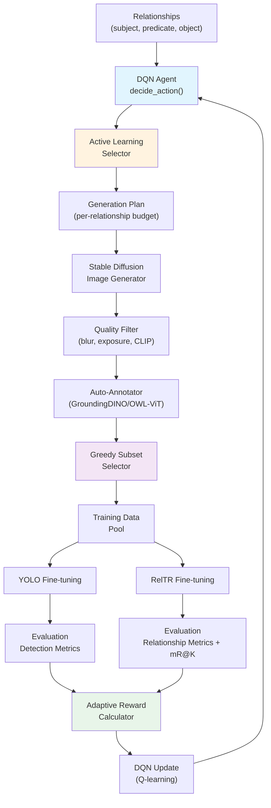
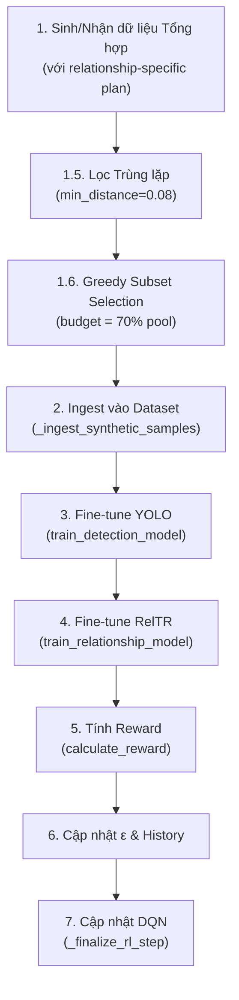
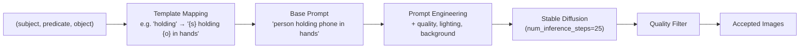
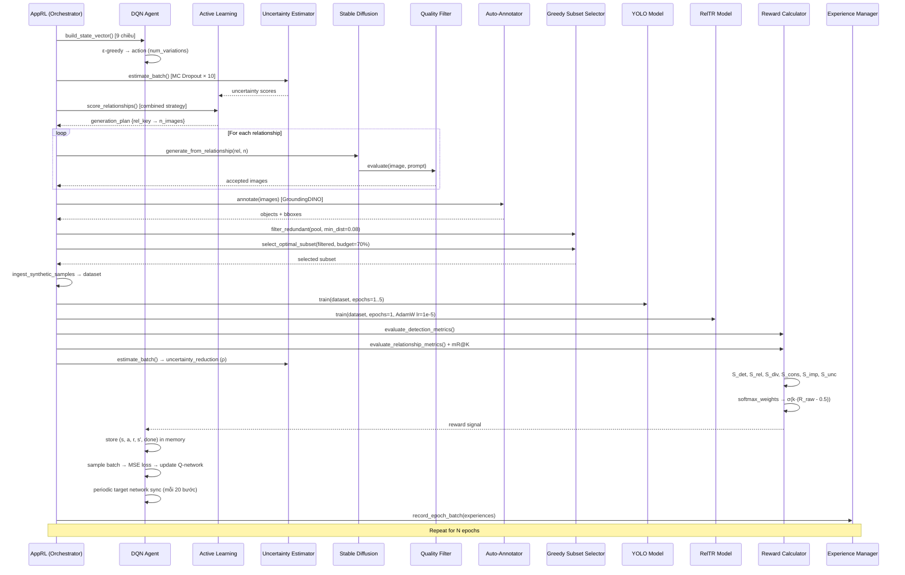

# Tài liệu Kỹ thuật Chi tiết: Module Học Tăng Cường (Reinforcement Learning)

## Mục lục

- [1. Tổng quan Kiến trúc](#1-tổng-quan-kiến-trúc)
- [2. Thành phần Lõi: RelationshipReinforcementLearning](#2-thành-phần-lõi-relationshipreinforcementlearning)
  - [2.1. Deep Q-Network (DQN) Agent](#21-deep-q-network-dqn-agent)
  - [2.2. Biểu diễn Trạng thái (State Representation)](#22-biểu-diễn-trạng-thái-state-representation)
  - [2.3. Không gian Hành động (Action Space)](#23-không-gian-hành-động-action-space)
  - [2.4. Chính sách Chọn Hành động (ε-greedy)](#24-chính-sách-chọn-hành-động-ε-greedy)
  - [2.5. Hệ thống Phần thưởng Thích ứng (Adaptive Reward System)](#25-hệ-thống-phần-thưởng-thích-ứng-adaptive-reward-system)
  - [2.6. Xử lý Long-tail (Tail Weights)](#26-xử-lý-long-tail-tail-weights)
  - [2.7. Quy trình Huấn luyện Episode (train_episode)](#27-quy-trình-huấn-luyện-episode-train_episode)
  - [2.8. Đánh giá Metric: Recall@K và Mean Recall@K](#28-đánh-giá-metric-recallk-và-mean-recallk)
- [3. Ước lượng Bất định: UncertaintyEstimator](#3-ước-lượng-bất-định-uncertaintyestimator)
  - [3.1. MC Dropout (Monte Carlo Dropout)](#31-mc-dropout-monte-carlo-dropout)
  - [3.2. Các Metric Bất định](#32-các-metric-bất-định)
  - [3.3. Theo dõi Giảm Bất định](#33-theo-dõi-giảm-bất-định)
- [4. Học Chủ động: ActiveLearningSelector](#4-học-chủ-động-activelearningselector)
  - [4.1. Chiến lược Chấm điểm](#41-chiến-lược-chấm-điểm)
  - [4.2. Kế hoạch Sinh dữ liệu (Generation Plan)](#42-kế-hoạch-sinh-dữ-liệu-generation-plan)
- [5. Thuật toán Xấp xỉ: GreedySubsetSelector](#5-thuật-toán-xấp-xỉ-greedysubsetselector)
  - [5.1. Greedy Submodular Maximization](#51-greedy-submodular-maximization)
  - [5.2. Hàm Mục tiêu Submodular](#52-hàm-mục-tiêu-submodular)
  - [5.3. Lọc trùng lặp (Deduplication)](#53-lọc-trùng-lặp-deduplication)
- [6. Sinh ảnh AI: RelationshipImageGenerator](#6-sinh-ảnh-ai-relationshipimagegenerator)
  - [6.1. Pipeline Sinh ảnh](#61-pipeline-sinh-ảnh)
  - [6.2. Bộ lọc Chất lượng (ImageQualityFilter)](#62-bộ-lọc-chất-lượng-imagequalityfilter)
- [7. Gán nhãn Tự động: AutoAnnotator](#7-gán-nhãn-tự-động-autoannotator)
- [8. Quản lý Thí nghiệm và Kinh nghiệm](#8-quản-lý-thí-nghiệm-và-kinh-nghiệm)
  - [8.1. ExperimentManager](#81-experimentmanager)
  - [8.2. ExperienceManager (Replay Buffer)](#82-experiencemanager-replay-buffer)
  - [8.3. ModelManager](#83-modelmanager)
- [9. Bộ điều phối: AppReinforcementLearning](#9-bộ-điều-phối-appreinforcementlearning)
- [10. Luồng Dữ liệu Tổng thể](#10-luồng-dữ-liệu-tổng-thể)

---

## 1. Tổng quan Kiến trúc

Module Học Tăng Cường (RL) là hệ thống vòng kín (closed-loop) được thiết kế để tự động cải thiện khả năng phát hiện quan hệ thị giác (Visual Relationship Detection) bằng cách:

1. **Sinh dữ liệu tổng hợp** (synthetic data) thông qua Stable Diffusion dựa trên các bộ ba quan hệ `(subject, predicate, object)`
2. **Gán nhãn tự động** (auto-annotation) bằng GroundingDINO / OWL-ViT
3. **Huấn luyện mô hình** phát hiện đối tượng (YOLO) và phát hiện quan hệ (RelTR) trên dữ liệu mới
4. **Đánh giá hiệu suất** và tính phần thưởng đa thành phần
5. **Tối ưu hóa chính sách** sinh dữ liệu bằng Deep Q-Network (DQN)
6. **Chọn mẫu thông minh** bằng Active Learning (uncertainty-based) và Greedy Submodular Maximization



### Cấu trúc File

| File | Dòng | Chức năng |
|------|------|-----------|
| `reinforcement_learning.py` | ~3680 | Lõi DQN agent, reward system, training loop, evaluation |
| `rl_enhancement.py` | ~563 | Bộ điều phối, quản lý vòng lặp epoch |
| `active_learning.py` | ~440 | Chấm điểm quan hệ, tạo generation plan |
| `uncertainty_estimator.py` | ~570 | MC Dropout, ước lượng bất định |
| `approximation_algorithm.py` | ~520 | Greedy Submodular Maximization |
| `ai_images_generator.py` | ~500 | Sinh ảnh Stable Diffusion, quality filter |
| `auto_annotator.py` | ~495 | Gán nhãn tự động (GroundingDINO/OWL-ViT/YOLO+CLIP) |
| `experience_manager.py` | ~222 | Quản lý Replay Buffer có lưu trữ |
| `model_manager.py` | ~235 | Quản lý checkpoint mô hình |
| `experiment_manager.py` | ~541 | Quản lý thí nghiệm, biểu đồ |

---

## 2. Thành phần Lõi: RelationshipReinforcementLearning

Lớp `RelationshipReinforcementLearning` (file `reinforcement_learning.py`, ~3680 dòng) là trung tâm của toàn bộ hệ thống RL, chịu trách nhiệm cho DQN agent, hệ thống phần thưởng, huấn luyện mô hình, và đánh giá.

### 2.1. Deep Q-Network (DQN) Agent

#### Cấu trúc Q-Network

Q-network là một mạng feedforward 3 lớp với **input 9 chiều** (khớp code `_build_q_network`):

```
Input (9 chiều) → Linear(9, 64) → ReLU → Linear(64, 64) → ReLU → Linear(64, 10) → Output
```

Mạng ước lượng giá trị Q cho mỗi hành động:

$$Q(s, a; \theta) : \mathbb{R}^9 \rightarrow \mathbb{R}^{10}$$

Gồm hai mạng:
- **Q-network** (`q_network`): Mạng chính để chọn hành động
- **Target network** (`target_network`): Bản sao đóng băng, được cập nhật định kỳ mỗi 20 bước (`target_update_interval = 20`)

#### Cập nhật Q-Network

Hàm mất mát MSE được sử dụng:

$$\mathcal{L}(\theta) = \frac{1}{|B|} \sum_{(s,a,r,s',d) \in B} \left(Q(s,a;\theta) - y\right)^2$$

trong đó target value:

$$y = r + \gamma \cdot (1 - d) \cdot \max_{a'} Q(s', a'; \theta^{-})$$

với:
- $B$: Mini-batch lấy ngẫu nhiên từ replay buffer (kích thước 32)
- $\gamma = 0.95$: Hệ số chiết khấu
- $\theta^{-}$: Tham số của target network
- $d \in \{0, 1\}$: Cờ kết thúc episode

Optimizer: **AdamW** với learning rate $\eta = 10^{-3}$.

### 2.2. Biểu diễn Trạng thái (State Representation)

Vector trạng thái $s \in \mathbb{R}^9$ gồm **9 thành phần** (khớp code `_build_state_vector`):

$$s = \big[F1_{\text{det}},\; \tfrac{N_{\text{det}}}{100},\; F1_{\text{rel}},\; \tfrac{|\mathcal{R}|}{200},\; \tanh(r),\; \tanh(\varepsilon),\; \tfrac{t}{T},\; \bar{U},\; U_{\max}\big]$$

| Chỉ số | Thành phần | Mô tả | Miền |
|--------|-----------|-------|------|
| 0 | $F1_{\text{det}}$ | F1-score detection; proxy: $\max(0, 1-\tanh(\ell_{\text{det}}/5))$ | [0, 1] |
| 1 | $N_{\text{det}}/100$ | Số lượng phát hiện (TP+FP), chuẩn hóa, clip ≤ 1 | [0, 1] |
| 2 | $F1_{\text{rel}}$ | F1-score relationship; proxy từ loss | [0, 1] |
| 3 | $|\mathcal{R}|/200$ | Số lượng quan hệ GT (TP+FN), chuẩn hóa, clip ≤ 1 | [0, 1] |
| 4 | $\tanh(r)$ | Phần thưởng bước trước (chuẩn hóa) | [-1, 1] |
| 5 | $\tanh(\varepsilon)$ | Tỷ lệ khám phá hiện tại | [0, 1] |
| 6 | $t/T$ | Tiến độ epoch (current / total, clip ≤ 1) | [0, 1] |
| 7 | $\bar{U}$ | Độ bất định trung bình (MC Dropout), mặc định 0.5 | [0, 1] |
| 8 | $U_{\max}$ | Độ bất định tối đa (MC Dropout), mặc định 0.5 | [0, 1] |

> **Fallback**: Khi chưa có F1 thật (epoch đầu), hệ thống dùng pseudo-F1 từ loss: $\hat{F1} = \max\big(0,\; 1 - \tanh(\ell/5)\big)$.

### 2.3. Không gian Hành động (Action Space)

$$\mathcal{A} = \{1, 2, 3, 4, 5, 6, 7, 8, 9, 10\}$$

Mỗi hành động $a \in \mathcal{A}$ biểu diễn **số lượng biến thể ảnh cần sinh** cho mỗi quan hệ (base variations). Khi kết hợp với Active Learning, giá trị này được nhân với số quan hệ để tạo tổng ngân sách (`total_budget = a × |R|`), sau đó phân bổ không đều theo điểm ưu tiên.

### 2.4. Chính sách Chọn Hành động (ε-greedy)

$$a = \begin{cases} \text{random}(\mathcal{A}) & \text{với xác suất } \varepsilon \\ \arg\max_{a'} Q(s, a'; \theta) & \text{với xác suất } 1 - \varepsilon \end{cases}$$

Quy luật suy giảm epsilon:

$$\varepsilon_{t+1} = \max\big(\varepsilon_{\min},\; \varepsilon_t \cdot \delta\big)$$

với $\varepsilon_0 = 0.9$, $\delta = 0.995$, $\varepsilon_{\min} = 0.01$.

### 2.5. Hệ thống Phần thưởng Thích ứng (Adaptive Reward System)

Phần thưởng tổng hợp $R$ được tính từ **6 thành phần** kết hợp với **trọng số động**:

$$R_{\text{raw}} = \sum_{i=1}^{6} W_i \cdot S_i = W_{\text{det}} S_{\text{det}} + W_{\text{rel}} S_{\text{rel}} + W_{\text{div}} S_{\text{div}} + W_{\text{cons}} S_{\text{cons}} + W_{\text{imp}} S_{\text{imp}} + W_{\text{unc}} S_{\text{unc}}$$

$$R = \sigma\big(k \cdot (R_{\text{raw}} - 0.5)\big) = \frac{1}{1 + e^{-k(R_{\text{raw}} - 0.5)}}$$

trong đó $k$ là scaling factor thích ứng (xem Mục 2.5.8).

---

#### 2.5.1. Điểm Phát hiện Đối tượng ($S_{\text{det}}$)

$$S_{\text{det}} = F1_{\text{det}} \cdot C_n \cdot B_{PR}$$

- **Hệ số tin cậy mẫu**: $C_n = \tanh(\alpha \cdot \ln(n + 1))$, với $\alpha = 0.5$, $n$ = số mẫu đánh giá
- **Hệ số cân bằng P-R**: $B_{PR} = 2\sqrt{P\cdot R}/(P+R)$ (GM/AM), $\in (0,1]$

#### 2.5.2. Điểm Phát hiện Quan hệ ($S_{\text{rel}}$)

$$S_{\text{rel}} = F1_{\text{rel}} \cdot C_n \cdot B_{PR} + \beta \cdot W_{\text{tail}} \cdot F1_{\text{rel}}, \quad \text{clip } [0,1]$$

trong đó $\beta = 0.5$, $W_{\text{tail}}$ là trọng số long-tail trung bình từ `tail_weights` (xem Mục 2.6). Thành phần $\beta \cdot W_{\text{tail}} \cdot F1_{\text{rel}}$ là "thưởng thêm" cho quan hệ hiếm, bị chặn bởi $\beta \cdot F1_{\text{rel}} \leq \beta$.

#### 2.5.3. Điểm Đa dạng ($S_{\text{div}}$)

$$S_{\text{div}} = 0.4 \cdot D_{\text{type}} + 0.4 \cdot D_{\text{class}} + 0.2 \cdot S_{\text{spatial}}$$

- $D_{\text{type}} = \frac{|\text{unique relations}|}{\max(N_{\text{rel\_types}}, 1)}$ — tỷ lệ loại quan hệ xuất hiện
- $D_{\text{class}} = \frac{|\text{unique subjects} \cup \text{unique objects}|}{\max(N_{\text{class\_types}}, 1)}$ — tỷ lệ lớp đối tượng

**Đa dạng Không gian** ($S_{\text{spatial}}$):

$$S_{\text{spatial}} = 0.4 \cdot S_{\text{pos}} + 0.3 \cdot S_{\text{size}} + 0.3 \cdot S_{\text{coverage}}$$

- **Vị trí**: $S_{\text{pos}} = \tanh\big(\alpha \cdot \text{Var}_{\text{pos}}\big)$, với $\text{Var}_{\text{pos}} = \text{Var}(\bar{x}_{\text{norm}}) + \text{Var}(\bar{y}_{\text{norm}})$
- **Kích thước**: $S_{\text{size}} = \mathrm{CV}(\text{areas}) = \frac{\sigma_{\text{area}}}{\mu_{\text{area}}}$ (Coefficient of Variation)
- **Độ phủ**: $S_{\text{coverage}} = \frac{H(\text{grid})}{H_{\max}}$, với $H = -\sum_i p_i \ln(p_i)$ là entropy phân bố lưới 4×4

#### 2.5.4. Điểm Nhất quán ($S_{\text{cons}}$)

$$S_{\text{cons}} = 0.7 \cdot S_{\text{std}} + 0.3 \cdot S_{\text{trend}}^{\text{cons}}$$

- **Nghịch đảo độ lệch chuẩn**: $S_{\text{std}} = \frac{1}{1 + \sigma_{F1}}$
- **Xu hướng dài hạn** ($S_{\text{trend}}^{\text{cons}}$): Hệ số góc hồi quy tuyến tính của chuỗi F1 **20 epoch gần nhất** (tách nguồn với $S_{\text{imp}}$ để giảm đa cộng tuyến):

$$S_{\text{trend}}^{\text{cons}} = \text{LinearSlope}\big(F1_{t-20:t}\big) \mapsto [0,1]$$

#### 2.5.5. Điểm Cải thiện ($S_{\text{imp}}$)

$$S_{\text{imp}} = 0.6 \cdot \Big(0.5 + 0.5 \cdot \tanh(F1_{\text{current}} - F1_{\text{base}})\Big) + 0.4 \cdot S_{\text{trend}}^{\text{imp}}$$

- **$F1_{\text{current}}$**: Trung bình relationship score **5 epoch gần nhất** (ngắn hạn)
- **$F1_{\text{base}}$**: Baseline từ `baseline_performance['relationship']`
- **$S_{\text{trend}}^{\text{imp}}$**: Hệ số góc hồi quy **5 epoch gần nhất** (tách nguồn với $S_{\text{cons}}$):

$$S_{\text{trend}}^{\text{imp}} = \text{LinearSlope}\big(F1_{t-5:t}\big) \mapsto [0,1]$$

#### 2.5.6. Điểm Giảm Bất định ($S_{\text{unc}}$)

Sử dụng **tanh** để đảm bảo $S_{\text{unc}} \in (0, 1)$ tự nhiên, không cần clip cứng (khớp code `calculate_reward` và README §12.7):

$$S_{\text{unc}} = 0.5 + 0.5 \cdot \tanh(\lambda \cdot \rho)$$

trong đó:
- $\lambda = 2$ (hệ số scale, cấu hình `unc_rho_lambda`)
- $\rho$ là mức giảm uncertainty trung bình (relative) so với epoch trước (xem Mục 3.3):

$$\rho = \frac{1}{|\mathcal{K}|}\sum_{k \in \mathcal{K}} \frac{U_{\text{prev},k} - U_{\text{current},k}}{U_{\text{prev},k}}$$

Tính chất:
- $S_{\text{unc}} \to 0.5$: $\rho \approx 0$ (trung tính) hoặc lỗi/không có estimator
- $S_{\text{unc}} \to 1$: $\rho \gg 0$ (giảm mạnh uncertainty)
- $S_{\text{unc}} \to 0$: $\rho \ll 0$ (tăng mạnh uncertainty), chặn mượt bởi tanh

---

#### 2.5.7. Trọng số Động (Dynamic Weights) — Công thức Softmax

Trọng số cơ bản (prior):

| Thành phần | $W_k^0$ |
|------------|---------|
| Detection | 0.25 |
| Relationship | 0.45 |
| Diversity | 0.15 |
| Consistency | 0.10 |
| Improvement | 0.05 |
| Uncertainty Reduction | 0.10 |

Trọng số được điều chỉnh dựa trên **softmax kết hợp prior** để đảm bảo $W_k > 0$ luôn và $\sum_k W_k = 1$ (khớp code `_calculate_dynamic_weights` và README §12.8):

$$W_k = \frac{W_k^0 \cdot \exp\!\big(\alpha\,(b_k - S_k)\big)}{\sum_j W_j^0 \cdot \exp\!\big(\alpha\,(b_j - S_j)\big)}$$

với $\alpha = 0.2$ (hệ số điều chỉnh) và $b_k$ là baseline cho thành phần $k$.

**Tính chất:**
- $\exp(\alpha(b_k - S_k))$ lớn khi $S_k < b_k$ (thành phần yếu) → $W_k$ cao hơn
- Prior $W_k^0$ vẫn tham gia nên phân bố ban đầu được tôn trọng
- Trong code: trừ $\max_k \alpha(b_k - S_k)$ trước khi `exp` để ổn định số học

**Cập nhật Baseline** (EWMA):

$$b_k^{(t+1)} = \alpha_{\text{ewma}} \cdot \bar{S}_k^{\text{recent}} + (1 - \alpha_{\text{ewma}}) \cdot b_k^{(t)}$$

với $\alpha_{\text{ewma}} = 0.3$ và $\bar{S}_k^{\text{recent}}$ là trung bình 10 giá trị gần nhất.

#### 2.5.8. Hàm Scaling

$$R = \sigma\big(k \cdot (R_{\text{raw}} - 0.5)\big)$$

Scaling factor $k$ thích ứng theo độ lệch chuẩn phần thưởng thô gần đây (khớp code `_get_current_scaling_factor` và README §12.1):

$$k = k_{\min} + (k_{\max} - k_{\min}) \cdot \frac{1}{1 + \sigma_{\text{recent}}}$$

với:
- $k_{\min} = 3$, $k_{\max} = 10$ (cấu hình `reward_sigmoid_k_min`, `reward_sigmoid_k_max`)
- $\sigma_{\text{recent}}$: Độ lệch chuẩn của $R_{\text{raw}}$ trên $M$ bước gần nhất ($M = 10$, cấu hình `reward_sigmoid_M`)
- Khi performance **ổn định** ($\sigma_{\text{recent}} \to 0$): $k \to k_{\max}$ → sigmoid dốc hơn → phân biệt rõ reward tốt/xấu
- Khi performance **bất ổn** ($\sigma_{\text{recent}}$ lớn): $k$ nhỏ → sigmoid mềm hơn → ổn định huấn luyện

### 2.6. Xử lý Long-tail (Tail Weights)

Trọng số nghịch đảo tần suất cho quan hệ hiếm:

$$W_{\text{raw}}(r) = \frac{1}{\sqrt{\text{freq}(r) + \varepsilon}}$$

Chuẩn hóa:

$$W_{\text{tail}}(r) = \frac{W_{\text{raw}}(r)}{\sum_{r'} W_{\text{raw}}(r')}$$

với $\varepsilon = 10^{-3}$. Trọng số này:
- Tăng boost cho $S_{\text{rel}}$ khi đánh giá quan hệ hiếm
- Được dùng bởi Active Learning để ưu tiên sinh dữ liệu cho quan hệ hiếm
- Ảnh hưởng đến long-tail loss trong quá trình huấn luyện RelTR

### 2.7. Quy trình Huấn luyện Episode (train_episode)

Mỗi episode huấn luyện trải qua 7 bước:



#### Bước 3: Fine-tune YOLO

- Dataset chuẩn bị ở định dạng YOLO (images + labels + dataset.yaml)
- Số epoch: $\min(5, \text{current\_epoch} + 1)$ — tăng dần
- Batch size: 4, Image size: 640

#### Bước 4: Fine-tune RelTR

- Optimizer: **AdamW** ($\eta = 10^{-5}$, weight decay = $10^{-4}$)
- Loss: Weighted sum từ `criterion` (Hungarian matching loss)
- **Long-tail Loss**: $\ell_{\text{tail}} = \ell_{\text{sample}} \cdot W_{\text{tail}}$ — trọng số cao hơn cho mẫu chứa quan hệ hiếm
- Hỗ trợ multi-epoch training trên toàn bộ dataset tích lũy
- Hỗ trợ **Global Context Tensor** để cung cấp ngữ cảnh cảnh vật

### 2.8. Đánh giá Metric: Recall@K và Mean Recall@K

#### Recall@K

Cho mỗi ảnh, sắp xếp dự đoán theo confidence giảm dần, lấy top-K:

$$R@K = \frac{|P_K \cap G|}{|G|}$$

#### Mean Recall@K (mR@K)

Công bằng hơn cho quan hệ hiếm — trung bình R@K **theo từng loại** quan hệ:

$$mR@K = \frac{1}{|T|} \sum_{t \in T} R@K_t$$

trong đó $T$ là tập loại quan hệ, $R@K_t$ là recall cho loại $t$. Hệ thống tính mR@10, mR@20, mR@50, mR@100.

#### Confusion Matrix cho Quan hệ

Mỗi quan hệ được chuẩn hóa thành tuple `(subject, predicate, object)` (lowercase, bỏ dấu cách thừa) để so sánh:

$$\text{TP} = |G_{\text{norm}} \cap P_{\text{norm}}|, \quad \text{FP} = |P_{\text{norm}} \setminus G_{\text{norm}}|, \quad \text{FN} = |G_{\text{norm}} \setminus P_{\text{norm}}|$$

---

## 3. Ước lượng Bất định: UncertaintyEstimator

File `uncertainty_estimator.py` (~570 dòng) triển khai phương pháp **MC Dropout** (Gal & Ghahramani, 2016) để ước lượng bất định nhận thức (epistemic uncertainty) mà không cần ensemble nhiều mô hình.

### 3.1. MC Dropout (Monte Carlo Dropout)

**Nguyên lý**: Khi inference, bật dropout ở chế độ training, thực hiện $T$ lần forward pass. Mỗi lần dropout ngẫu nhiên bỏ khác nhau → tạo ra $T$ dự đoán khác nhau, xấp xỉ posterior predictive.

```python
# Bật dropout khi inference
for module in model.modules():
    if isinstance(module, nn.Dropout):
        module.train()  # Giữ dropout ở training mode

# T forward passes
predictions = [model(x) for _ in range(T)]  # T = 10
```

Tham số mặc định: $T = 10$ (`n_forward_passes`).

### 3.2. Các Metric Bất định

Cho $T$ forward passes, mỗi pass cho phân phối xác suất $p_t(y|x)$:

#### (a) Predictive Entropy

$$H[\bar{y}] = -\sum_{c=1}^{C} \bar{p}_c \cdot \ln(\bar{p}_c + 10^{-10})$$

trong đó $\bar{p}_c = \frac{1}{T}\sum_{t=1}^{T} p_t(y=c|x)$ là xác suất trung bình cho lớp $c$.

Chuẩn hóa: $\hat{H} = \frac{H[\bar{y}]}{\ln C}$ → miền $[0, 1]$.

#### (b) Mutual Information (BALD)

$$I[y; \omega | x] = H[\bar{y}] - \frac{1}{T}\sum_{t=1}^{T} H[y|\omega_t, x]$$

$$= H[\bar{y}] + \frac{1}{T}\sum_{t=1}^{T}\sum_{c} p_t(y=c|x) \cdot \ln\big(p_t(y=c|x) + 10^{-10}\big)$$

Chuẩn hóa tương tự: $\hat{I} = \frac{I}{\ln C}$.

BALD đo **epistemic uncertainty** — bất định do thiếu dữ liệu, có thể giảm bằng cách thêm dữ liệu.

#### (c) Variation Ratio

$$VR = 1 - \frac{\text{mode\_count}}{T}$$

trong đó `mode_count` là số lần lớp phổ biến nhất được dự đoán. $VR = 0$ nghĩa tất cả $T$ pass đều đồng ý, $VR$ cao = bất đồng lớn.

#### (d) Điểm Bất định Tổng hợp

Kết hợp 4 metric thành điểm duy nhất $U \in [0, 1]$ (khớp code `_compute_combined_score`):

$$U = 0.3 \cdot \hat{H} + 0.3 \cdot \hat{I} + 0.2 \cdot VR + 0.2 \cdot (1 - \bar{c})$$

trong đó $\bar{c}$ là confidence trung bình trên tất cả predictions.

### 3.3. Theo dõi Giảm Bất định

Hệ thống so sánh uncertainty giữa các epoch bằng **relative reduction** (khớp code `compute_uncertainty_reduction`):

$$\text{reduction}_k = \frac{U_{\text{prev},k} - U_{\text{current},k}}{U_{\text{prev},k}} \quad \text{(chỉ với } U_{\text{prev},k} > 0\text{)}$$

$$\rho = \frac{1}{|\mathcal{K}|} \sum_{k \in \mathcal{K}} \text{reduction}_k$$

trong đó $\mathcal{K}$ là tập các mẫu có mặt ở cả hai epoch.
- $\rho > 0$ → mô hình đang học (uncertainty giảm)
- $\rho < 0$ → uncertainty tăng (cần điều chỉnh)
- $\rho = 0$ → không đổi hoặc lần đầu (chưa có cache)

Sau khi tính, cache được cập nhật: `_previous_uncertainties ← current_uncertainties`.

---

## 4. Học Chủ động: ActiveLearningSelector

File `active_learning.py` triển khai chiến lược Active Learning để phân bổ ngân sách sinh dữ liệu thông minh.

### 4.1. Chiến lược Chấm điểm

Hệ thống hỗ trợ 4 chiến lược: `uncertainty`, `performance`, `combined`, `random`.

#### Chiến lược Combined (mặc định):

Cho mỗi quan hệ $r$:

$$\text{Score}(r) = \alpha_u \cdot U(r) + \alpha_p \cdot (1 - F1(r)) + \alpha_t \cdot W_{\text{tail}}(r)$$

với trọng số mặc định:
- $\alpha_u = 0.4$ (uncertainty)
- $\alpha_p = 0.4$ (performance — nghịch đảo F1)
- $\alpha_t = 0.2$ (tail weight)

**Tính Uncertainty cho quan hệ**: $U(r)$ là uncertainty trung bình trên các mẫu đánh giá liên quan đến quan hệ $r$, ước lượng qua MC Dropout (Mục 3).

**Tính Performance**: $F1(r)$ lấy từ `relationship_performance` (average F1 gần nhất cho quan hệ đó). Score cao khi $F1$ thấp (cần nhiều dữ liệu hơn).

### 4.2. Kế hoạch Sinh dữ liệu (Generation Plan)

Sau khi có điểm cho mỗi quan hệ, hệ thống phân bổ tổng ngân sách $B$:

1. **Đảm bảo tối thiểu**: Mỗi quan hệ nhận ít nhất `min_per_rel` = 1 ảnh
2. **Phân bổ theo tỷ lệ điểm**: Phần ngân sách còn lại phân bổ tỷ lệ với `Score(r)`
3. **Giới hạn tối đa**: Mỗi quan hệ không quá `max_per_rel` ảnh
4. **Phân phối lại**: Phần bị thừa do cap sẽ phân bổ cho các quan hệ khác

$$n_r = \min\Big(\text{max\_per\_rel},\; \text{min\_per\_rel} + \Big\lfloor\frac{\text{Score}(r) \cdot B_{\text{remaining}}}{\sum_{r'} \text{Score}(r')}\Big\rfloor\Big)$$

---

## 5. Thuật toán Xấp xỉ: GreedySubsetSelector

File `approximation_algorithm.py` triển khai **Greedy Submodular Maximization** (Nemhauser et al., 1978) để chọn tập con tối ưu từ pool ảnh synthetic.

### 5.1. Greedy Submodular Maximization

**Bài toán**: Cho pool $\mathcal{P}$ gồm $n$ mẫu synthetic, chọn tập $S \subseteq \mathcal{P}$ với $|S| \leq B$ sao cho $f(S)$ cực đại, trong đó $f$ là hàm submodular.

**Thuật toán**:

$$S \leftarrow \emptyset$$
$$\text{for } i = 1 \text{ to } B: \quad s^* = \arg\max_{s \in \mathcal{P} \setminus S} \big[f(S \cup \{s\}) - f(S)\big], \quad S \leftarrow S \cup \{s^*\}$$

**Đảm bảo xấp xỉ**: $f(S) \geq (1 - 1/e) \cdot f(S^*) \approx 0.632 \cdot \text{OPT}$

**Dừng sớm**: Nếu marginal gain $< 10^{-6}$ và đã chọn > 50% budget → tính chất diminishing returns.

### 5.2. Hàm Mục tiêu Submodular

$$f(S) = \lambda_1 \cdot \text{Diversity}(S) + \lambda_2 \cdot \text{Quality}(S) + \lambda_3 \cdot \text{Representativeness}(S)$$

Trọng số mặc định: $\lambda_1 = 0.5$, $\lambda_2 = 0.3$, $\lambda_3 = 0.2$.

#### Marginal Gain

$$\Delta f(s | S) = f(S \cup \{s\}) - f(S) = \lambda_1 \cdot \Delta D + \lambda_2 \cdot Q(s) + \lambda_3 \cdot \Delta R$$

**(a) Diversity Gain** ($\Delta D$):

$$\Delta D(s | S) = \min_{s' \in S} d(s, s')$$

Khoảng cách Euclidean chuẩn hóa giữa feature vectors 7 chiều. Nếu $S = \emptyset$ thì $\Delta D = 1.0$.

**(b) Quality Gain** ($Q(s)$):

Trung bình 4 yếu tố:
- Confidence trung bình (từ detector)
- Chất lượng annotation backend (GroundingDINO: 0.9, OWL-ViT: 0.7, YOLO+CLIP: 0.8, pseudo: 0.3)
- Độ hoàn chỉnh quan hệ (có đủ subject/relation/object)
- Có bounding box hợp lệ

**(c) Representativeness Gain** ($\Delta R$):

$$\Delta R(s | S) = \frac{|\{u \in \mathcal{P} \setminus (S \cup \{s\}) : d(s, u) < \min_{s' \in S} d(s', u)\}|}{|\mathcal{P} \setminus (S \cup \{s\})|}$$

Tỷ lệ mẫu chưa chọn mà $s$ trở thành nearest neighbor mới → đo mức "đại diện".

#### Feature Vector (7 chiều)

| Chỉ số | Đặc trưng | Mô tả |
|--------|-----------|-------|
| 0-1 | $(\bar{x}, \bar{y})$ / 1000 | Tâm bounding box trung bình, chuẩn hóa |
| 2 | $\bar{A}$ / 10⁶ | Diện tích bbox trung bình, chuẩn hóa |
| 3 | rel_type / 100 | Index mã hóa loại quan hệ |
| 4 | subject / 100 | Index mã hóa lớp subject |
| 5 | object / 100 | Index mã hóa lớp object |
| 6 | $\bar{c}$ | Confidence trung bình |

### 5.3. Lọc trùng lặp (Deduplication)

Trước Greedy Selection, hệ thống lọc mẫu trùng lặp:

1. Tính feature vector cho mỗi mẫu
2. Duyệt tuần tự, giữ mẫu nếu khoảng cách đến tất cả mẫu đã giữ ≥ `min_distance` (mặc định 0.08)

Ngân sách chọn: $B = \max(3, \lfloor 0.7 \cdot |\text{filtered pool}| \rfloor)$ — giữ 70% đa dạng nhất.

---

## 6. Sinh ảnh AI: RelationshipImageGenerator

File `ai_images_generator.py` sử dụng **Stable Diffusion v1.5** để sinh ảnh tổng hợp từ bộ ba quan hệ.

### 6.1. Pipeline Sinh ảnh



#### Template Mapping

26 template quan hệ định nghĩa sẵn (spatial, action, state), với fallback `"{subject} {relation} {object}"`.

#### Prompt Engineering

Mỗi biến thể kết hợp ngẫu nhiên từ 6 nhóm:
1. **Quality modifiers**: "photorealistic", "4k", "masterpiece"...
2. **Lighting**: "golden hour", "studio lighting", "dramatic"...
3. **Background/Location**: 27 context (indoor, outdoor urban, outdoor natural, specific)
4. **Time/Weather**: 70% chance thêm (9 lựa chọn)
5. **Style**: 50% chance thêm (6 lựa chọn)
6. **Composition**: 40% chance thêm (7 lựa chọn)

#### Tối ưu Sinh ảnh

- **Batch generation**: batch_size = 2 (GPU memory efficient)
- **xFormers** hoặc Flash Attention 2.0 nếu có
- **VAE slicing** cho memory thấp
- **torch.compile** (PyTorch 2.0+) với mode `reduce-overhead`
- **channels_last** memory format
- **torch.inference_mode()** thay vì `torch.no_grad()` (nhanh hơn)

### 6.2. Bộ lọc Chất lượng (ImageQualityFilter)

Mỗi ảnh sinh ra phải qua 5 bước kiểm tra tuần tự:

| Bước | Kiểm tra | Tiêu chí Loại bỏ |
|------|----------|-------------------|
| 1 | Kích thước/Tỷ lệ | Width hoặc Height < 512, aspect ratio > 2.2 |
| 2 | Độ mờ (Blur) | Laplacian variance < 60.0 |
| 3 | Phơi sáng | Mean pixel ∉ [20, 235] hoặc clip ratio > 20% |
| 4 | Trùng lặp | pHash trùng với ảnh đã sinh (nếu có `imagehash`) |
| 5 | CLIP Similarity | Cosine similarity giữa ảnh và prompt < 0.23 (nếu có CLIP) |

Ảnh bị loại ở bất kỳ bước nào sẽ không được thêm vào dataset.

---

## 7. Gán nhãn Tự động: AutoAnnotator

File `auto_annotator.py` giải quyết vấn đề: Stable Diffusion chỉ trả về pixels, không có bounding box.

### Thứ tự Ưu tiên Backend

| Ưu tiên | Backend | Mô tả |
|---------|---------|-------|
| 1 | **GroundingDINO** | SOTA open-vocabulary detector, chất lượng cao nhất |
| 2 | **OWL-ViT** | Lighter, từ Hugging Face Transformers |
| 3 | **YOLO+CLIP** | Fallback, vocabulary hạn chế, dùng pipeline có sẵn |
| 4 | **Pseudo-Annotation** | Heuristic bbox dựa trên loại quan hệ (chất lượng thấp) |

### Quy trình Gán nhãn

1. Nhận ảnh synthetic + relationship `(subject, relation, object)`
2. Trích xuất text prompts: `["subject_text", "object_text"]`
3. Chạy detector với text prompts (GroundingDINO format: `"dog . surfboard"`)
4. Post-process: chuyển tọa độ chuẩn hóa `[cx, cy, w, h]` → pixel `[x1, y1, x2, y2]`
5. Clamp vào biên ảnh
6. Nếu detect thất bại → tạo pseudo-bbox dựa trên heuristic quan hệ

### Pseudo-Annotation Heuristics

Khi không backend nào detect được, hệ thống dùng template vị trí theo loại quan hệ:

- `on/above/over/riding`: Subject trên, Object dưới
- `under/below`: Subject dưới, Object trên
- `holding/carrying/using`: Subject lớn, Object nhỏ gần subject
- Mặc định: Subject trái, Object phải

Confidence cho pseudo = 0.3 (đánh dấu `is_pseudo = True`).

---

## 8. Quản lý Thí nghiệm và Kinh nghiệm

### 8.1. ExperimentManager

File `experiment_manager.py` quản lý vòng đời thí nghiệm:

```
experiments/
├── exp_001/
│   ├── metadata.json         # ID, thời gian, trạng thái
│   ├── ai_images/            # Ảnh AI sinh ra theo epoch
│   │   ├── epoch_01_img_000.jpg
│   │   └── images_list_epoch_01.json
│   ├── metrics/              # Metrics JSON theo epoch
│   │   └── training_metrics_epoch_01.json
│   ├── plots/                # Biểu đồ training
│   │   ├── training_plots_*.png
│   │   └── ai_images_grid_epoch_01.png
│   ├── models/               # Checkpoints
│   └── logs/
└── exp_001_cont_002/         # Continuation experiment
    └── ...
```

**Tính năng chính**:
- **Start New**: Tạo cấu trúc thư mục mới, ghi metadata
- **Continuation**: Copy model checkpoints + dataset snapshot từ experiment trước
- **Save AI Images**: Lưu ảnh JPEG (quality 95) + metadata JSON
- **Training Plots**: 4 subplot (losses, reward, AI images count, combined metrics)
- **AI Images Grid**: Grid ảnh $\lceil\sqrt{n}\rceil \times \lceil\sqrt{n}\rceil$, tối đa 16 ảnh
- **Finalize**: Cập nhật status, tạo summary report

### 8.2. ExperienceManager (Replay Buffer)

File `experience_manager.py` quản lý replay buffer có lưu trữ persistent:

- **In-memory buffer**: `deque(maxlen=50000)` — vòng đệm kinh nghiệm
- **Main buffer file**: `main_replay_buffer.pt` — lưu trữ qua các session
- **Per-experiment files**: `{experiment_id}_experiences.pt` — lưu theo experiment

**Quy trình**:
1. `record_epoch_batch()`: Nhận batch kinh nghiệm mới → append vào file experiment → merge vào main buffer
2. `_sanitize_experience()`: Loại bỏ dữ liệu không serialize được (PIL images, pixel_values)
3. Khi restart, `_load_main_buffer()` tự động load kinh nghiệm cũ

### 8.3. ModelManager

File `model_manager.py` quản lý checkpoint:

- **Checkpoint format**: `{model_name}_epoch_{epoch:02d}.pth` kèm `_metadata.json`
- **Nội dung checkpoint**: Bao gồm state_dict cho detection model, relationship model, Q-network, target network, cả hai optimizer, reltr_args, training_history
- **Best model selection**: Dựa trên metric (mặc định `reward`) từ training history
- **Model listing**: Liệt kê tất cả checkpoint trong experiment với metadata

---

## 9. Bộ điều phối: AppReinforcementLearning

File `rl_enhancement.py` đóng vai trò **orchestrator** tích hợp tất cả thành phần:

### Khởi tạo

```python
AppReinforcementLearning(app_instance)
├── RelationshipImageGenerator()          # Stable Diffusion
├── RelationshipDataAugmentation()        # Data augmentation
├── ExperimentManager()                   # Experiment lifecycle
├── ExperienceManager()                   # Replay buffer
└── RelationshipReinforcementLearning()   # Core RL (lazy init)
```

### Vòng lặp Huấn luyện Chính

```python
run_reinforcement_learning(epochs=5, continue_from=None, image_directory=None)
```

Mỗi epoch thực hiện:

1. **`decide_action()`**: DQN chọn hành động + Active Learning tạo generation plan
2. **`generate_ai_images_for_epoch()`**: Sinh ảnh với Stable Diffusion + lưu vào experiment
3. **Thay thế PIL image** bằng đường dẫn file (tiết kiệm RAM)
4. **`train_episode()`**: Huấn luyện detection + relationship + tính reward + cập nhật DQN
5. **`_store_epoch_experiences()`**: Lưu kinh nghiệm vào replay buffer
6. **Lưu metrics** và in báo cáo chi tiết

### Tiếp tục Huấn luyện

Khi `continue_from` được chỉ định:
1. Tạo continuation experiment (`exp_001_cont_002`)
2. Copy model checkpoints + dataset snapshot
3. Load model state (detection, relationship, Q-network, optimizer)
4. Validate & fix dataset samples

---

## 10. Luồng Dữ liệu Tổng thể



### Tổng kết Đóng góp của Từng Module

| Module | Vai trò trong Luồng dữ liệu |
|--------|------------------------------|
| **DQN Agent** | Ra quyết định: bao nhiêu dữ liệu cần sinh |
| **Active Learning** | Phân bổ thông minh: quan hệ nào cần nhiều dữ liệu hơn |
| **Uncertainty Estimator** | Đo lường: mô hình "biết" gì và "chưa biết" gì |
| **Image Generator** | Hành động: sinh dữ liệu synthetic chất lượng cao |
| **Quality Filter** | Kiểm định: loại bỏ ảnh kém chất lượng |
| **Auto-Annotator** | Bổ sung: gán bbox tự động cho ảnh synthetic |
| **Greedy Subset** | Tối ưu: chọn tập con đa dạng, chất lượng nhất |
| **YOLO + RelTR** | Học: fine-tune trên dữ liệu mới |
| **Reward System** | Phản hồi: đánh giá hiệu quả tổng thể |
| **Experience Manager** | Nhớ: lưu trữ kinh nghiệm để DQN học dần |

---

*Tài liệu được tạo từ phân tích mã nguồn module RL, khớp với README và code. Phiên bản: 2026-03-12.*
